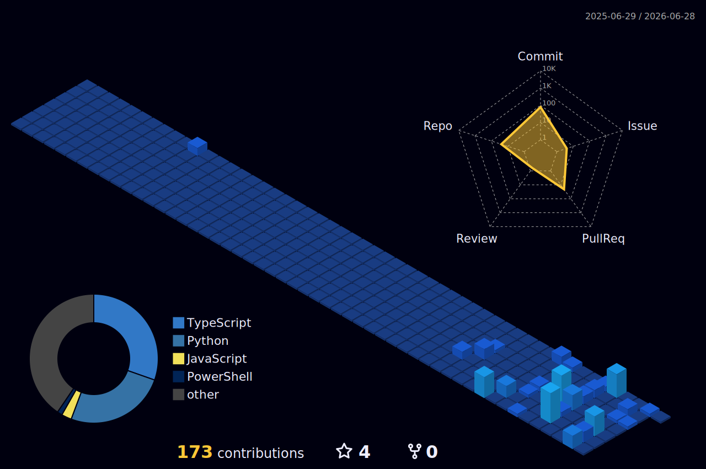

<h1 align="left">Hey, I'm Rajesh Bhanushali ✧</h1>

<a href="https://github.com/turfin-logic"></a>

<p align="left">
  <i>"Automating the present to rewrite the future."</i> ⚡
</p>

<p align="left">
  I'm an <b>Automation Developer</b> & <b>AI Engineer</b> with a passion for building autonomous systems and solving complex problems. I specialize in crafting multi-agent architectures, dynamic Discord swarms, and tools that streamline developer workflows. Whether it's analyzing repos with AI or managing a homelab, I build systems that run themselves.
</p>

### 🌌 What I'm currently up to:
- 🤖 Building **Ag-Sentinel** & **autofixer-agent** — autonomous AI systems for server monitoring and self-healing code.
- ⚡ Developing **repo-god**, an AI-powered GitHub repo health analyzer and auditor.
- 🛠️ Maintaining **homelab-monitor** for seamless GPU & local-AI model tracking.
- 📚 Expanding **Mangaverse**, bridging the gap between automation and my love for anime/manga.

---

### 🗡️ Tech Stack & Arsenal

<p align="left">
  <a href="https://www.python.org"></a>
  <a href="https://nodejs.org"></a>
  <a href="https://flutter.dev"></a>
  <a href="https://microsoft.com/powershell"></a>
  <a href="https://www.docker.com"></a>
</p>

---

### 🌃 The Commit City (3D Graph)
<p align="center">
  <a href="https://github.com/turfin-logic"></a>
</p>

---
### 🖥️ System Terminal

```text
              _
             | |
             | |===( )   //////
             |_|   |||  | o o|
                    ||| ( c  )                  ____
                     ||| \= /                  ||   \_
                      ||||||                   ||     |
                      ||||||                ...||__/|-"
                      ||||||             __|________|__
                        |||             |______________|
                        |||             || ||      || ||
                        |||             || ||      || ||
------------------------|||-------------||-||------||-||-------
                        |__>            || ||      || ||


     > executing autofixer-agent.sh...
     > crawling mangaverse...
     > hit any key to continue_
```

<p align="center">
  <a href="https://github.com/turfin-logic"></a>
</p>
